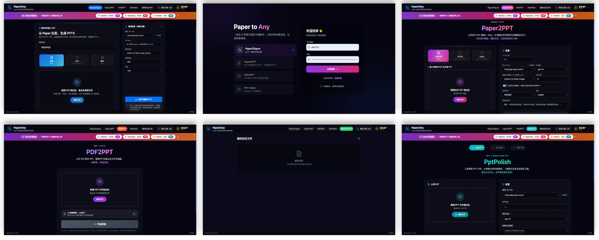
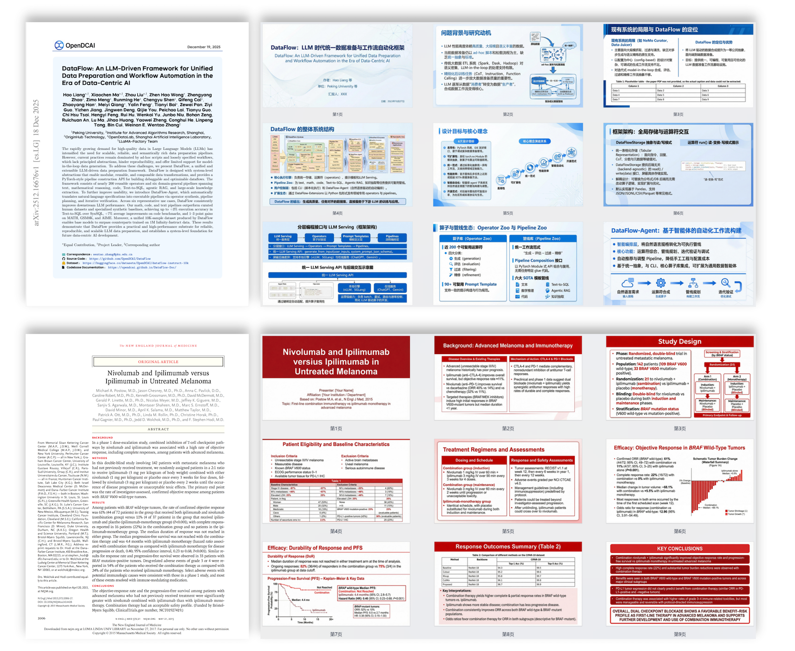
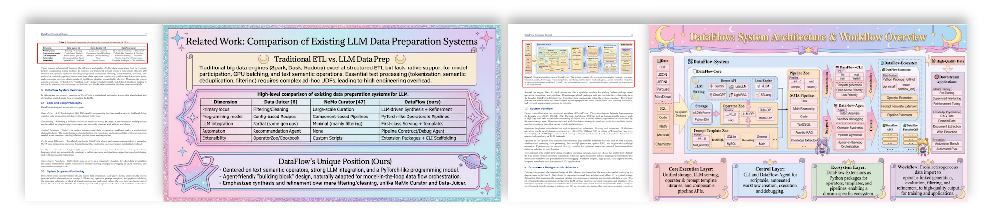
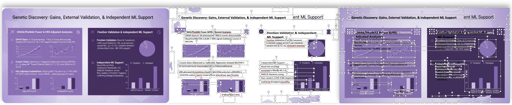
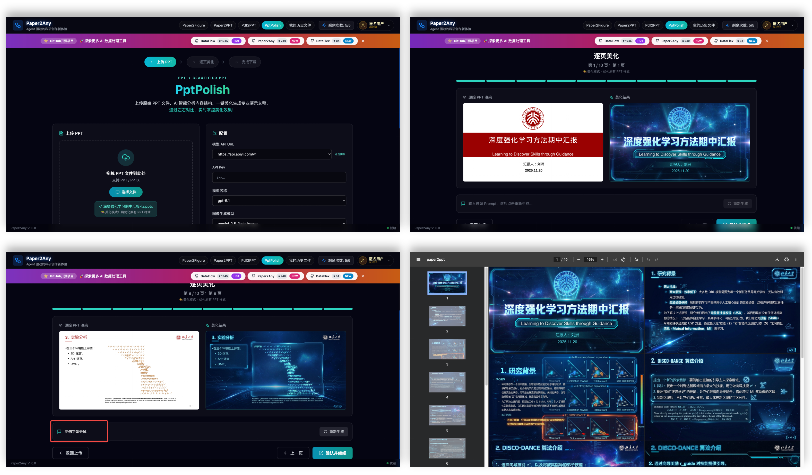

<div align="center">


# Paper2Any

[](https://www.python.org/)
[](LICENSE)
[](https://github.com/OpenDCAI/Paper2Any)
[](https://github.com/OpenDCAI/Paper2Any/stargazers)

English | [中文](README.md)

✨ **Focus on Paper Multimodal Workflow: One-click generation of model diagrams, technical roadmaps, experimental plots, and presentations from paper PDFs/screenshots/text** ✨

| 📄 **Universal File Support** &nbsp;|&nbsp; 🎯 **AI-Powered Generation** &nbsp;|&nbsp; 🎨 **Custom Styling** &nbsp;|&nbsp; ⚡ **Lightning Speed** |

<br>

<a href="#-quick-start" target="_self">
  
</a>
<a href="http://dcai-paper2any.nas.cpolar.cn/" target="_blank">
  
</a>
<a href="docs/" target="_blank">
  
</a>
<a href="docs/contributing.md" target="_blank">
  
</a>

<br>
<br>



</div>

---

## 📢 Roadmap & Announcement

> [!IMPORTANT]
> **This project is undergoing an architectural split to provide a more focused experience.**

- **[Paper2Any](https://github.com/OpenDCAI/Paper2Any)** (Current Repository):
  - Focuses on paper multimodal workflows (Paper2Figure, Paper2PPT, Paper2Video, etc.).
  - Provides researchers with one-click tools for plotting, PPT generation, and video scripting.

- **[DataFlow-Agent](https://github.com/OpenDCAI/DataFlow-Agent)** (New Repository):
  - Focuses on DataFlow operator orchestration and authoring.
  - Provides a general-purpose multi-agent dataflow processing framework and operator development tools.

---

## 📑 Table of Contents

- [🔥 News](#-news)
- [✨ Core Features](#-core-features)
- [📸 Showcase](#-showcase)
- [🚀 Quick Start](#-quick-start)
- [📂 Project Structure](#-project-structure)
- [🗺️ Roadmap](#️-roadmap)
- [🤝 Contributing](#-contributing)

---

## 🔥 News

> [!TIP]
> 🆕 <strong>2025-12-12 · Paper2Figure Web public beta is live</strong><br>
> One-click generation of multiple <strong>editable</strong> scientific figures (Model Architecture / Technical Roadmap / Experimental Plots)<br>
> 🌐 Online Demo: <a href="http://dcai-paper2any.nas.cpolar.cn/">http://dcai-paper2any.nas.cpolar.cn/</a>

- 2025-10-01 · Released <code>0.1.0</code> first version

---

## ✨ Core Features

> From paper PDFs / images / text to **editable** scientific figures, slide decks, video scripts, posters and more in one click.

Paper2Any currently includes the following sub-capabilities:

- **📊 Paper2Figure - Editable Scientific Figures**: One-click generation of model architecture diagrams, technical roadmaps (PPT + SVG), and experimental plots. Supports various input sources and outputs editable PPTX.
- **🎬 Paper2PPT - Editable Slide Decks**: Generate Beamer-style or open-format editable PPTs. Supports long document processing, with built-in table extraction and figure parsing capabilities.
- **🖼️ PDF2PPT - Layout Preserved Conversion**: Intelligent cutout and layout analysis to accurately convert PDFs into editable PPTX.
- **🎨 PPT Smart Beautification**: AI-based PPT layout optimization and style transfer.

---

## 📸 Showcase

### 📊 Paper2Figure: Scientific Figure Generation

<div align="center">

<br>

<br><sub>✨ Model Architecture Diagram Generation</sub>

<br><br>

<br><sub>✨ Technical Roadmap Generation</sub>

<br><br>

<br><sub>✨ Experimental Plot Generation (Multiple Styles)</sub>

</div>

---

### 🎬 Paper2PPT: Paper to Presentation

<div align="center">

<br>

<br><sub>✨ Paper / Text / Topic → PPT</sub>

<br><br>

<br><sub>✨ Long Document Support (40+ Slides)</sub>

<br><br>

<br><sub>✨ Intelligent Table Extraction & Insertion</sub>

</div>

---

### 🖼️ PDF2PPT: Layout Preserved Conversion

<div align="center">

<br>

<br><sub>✨ Intelligent Cutout & Layout Preservation</sub>

</div>

---

### 🎨 PPT Smart Beautification

<div align="center">

<br>

<br><sub>✨ AI-based Layout Optimization & Style Transfer</sub>

</div>

---

## 🚀 Quick Start

### Requirements


### 🐧 Linux Installation

> We recommend using Conda to create an isolated environment (Python 3.11).  

#### 1. Create Environment & Install Base Dependencies

```bash
# 0. Create and activate a conda environment
conda create -n paper2any python=3.11 -y
conda activate paper2any

# 1. Clone repository
git clone https://github.com/OpenDCAI/Paper2Any.git
cd Paper2Any

# 2. Install base dependencies
pip install -r requirements-base.txt

# 3. Install in editable (dev) mode
pip install -e .
```

#### 2. Install Paper2Any-specific Dependencies (Required)

Paper2Any involves LaTeX rendering, vector graphics processing and PPT/PDF conversion, which require extra dependencies:

```bash
# 1. Python dependencies
pip install -r requirements-paper.txt || pip install -r requirements-paper-backup.txt

# 2. LaTeX engine (tectonic) - recommended via conda
conda install -c conda-forge tectonic -y

# 3. Resolve doclayout_yolo dependency conflicts (Important)
pip install doclayout_yolo --no-deps

# 4. System dependencies (Ubuntu example)
sudo apt-get update
sudo apt-get install -y inkscape libreoffice poppler-utils wkhtmltopdf
```

#### 3. Environment Configuration

```bash
export DF_API_KEY=your_api_key_here
export DF_API_URL=xxx  # Optional: if using a third-party API gateway
export MINERU_DEVICES="0,1,2,3" # Optional: MinerU task GPU resource pool
```

### 🪟 Windows Installation

> [!NOTE]  
> We recommend Linux / WSL for best experience.  
> If you need to deploy on native Windows, please refer to the [Windows Installation](#-windows-installation) section or `README_EN.md`.

---

### Launch Applications

#### 🎨 Web Frontend (Recommended)

```bash
# Start backend API
cd fastapi_app
uvicorn main:app --host 0.0.0.0 --port 8000

# Start frontend (new terminal)
cd frontend-workflow
npm install
npm run dev
```

Visit `http://localhost:3000`.

> [!TIP]
> If you don't want to deploy frontend/backend for now, you can try core features via local scripts:
> - `python script/run_paper2figure.py`: model architecture diagram generation
> - `python script/run_paper2ppt.py`: PPT generation from content
> - `python script/run_pdf2ppt_with_paddle_sam_mineru.py`: PDF2PPT

---

## 📂 Project Structure

```
Paper2Any/
├── dataflow_agent/          # Core framework code
│   ├── agentroles/         # Agent definitions
│   │   └── paper2any_agents/ # Agents specific to Paper2Any
│   ├── workflow/           # Workflow definitions
│   ├── promptstemplates/   # Prompt template library
│   └── toolkits/           # Toolkits (Figure gen, PPT gen, etc.)
├── fastapi_app/            # FastAPI backend service
├── frontend-workflow/      # Frontend workflow editor
├── static/                 # Static resources
├── script/                 # Script tools
└── tests/                  # Test cases
```

---

## 🗺️ Roadmap

<table>
<tr>
<th width="35%">Feature</th>
<th width="15%">Status</th>
<th width="50%">Sub-features</th>
</tr>
<tr>
<td><strong>📊 Paper2Figure</strong><br><sub>Editable Scientific Figures</sub></td>
<td></td>
<td>
<br>
<br>
<br>

</td>
</tr>
<tr>
<td><strong>🎬 Paper2PPT</strong><br><sub>Editable Slide Decks</sub></td>
<td></td>
<td>
<br>
<br>
<br>

</td>
</tr>
<tr>
<td><strong>🖼️ PDF2PPT</strong><br><sub>Layout Preserved Conversion</sub></td>
<td></td>
<td>
<br>
<br>

</td>
</tr>
<tr>
<td><strong>🎨 PPT Beautification</strong><br><sub>Smart Layout Optimization</sub></td>
<td></td>
<td>
<br>

</td>
</tr>
</table>

---

## 🤝 Contributing

We welcome all forms of contributions!

[](https://github.com/OpenDCAI/Paper2Any/issues)
[](https://github.com/OpenDCAI/Paper2Any/discussions)
[](https://github.com/OpenDCAI/Paper2Any/pulls)

---

## 📄 License

This project is licensed under [Apache License 2.0](LICENSE).

---

<div align="center">

**If this project helps you, please give us a ⭐️ Star!**

[](https://github.com/OpenDCAI/Paper2Any/stargazers)
[](https://github.com/OpenDCAI/Paper2Any/network/members)

<br>


<br>
<sub>Scan to join the community group</sub>

<p align="center"> 
  <em> ❤️ Made with by OpenDCAI Team</em>
</p>

</div>
